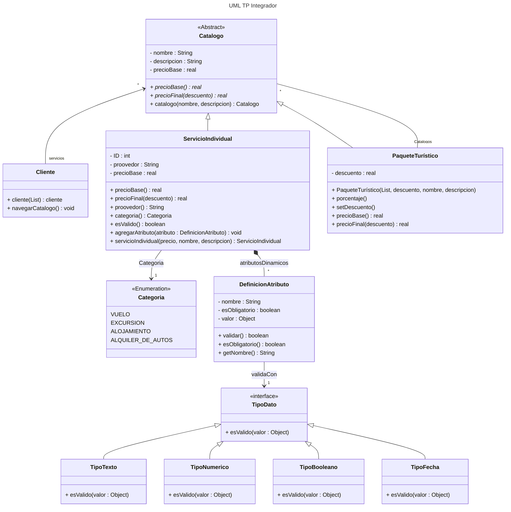

```mermaid
---
title: UML TP Integrador
---

classDiagram
    Catalogo "*" <-- "servicios" Cliente
    Catalogo <|-- ServicioIndividual
    Catalogo <|-- PaqueteTurístico
    PaqueteTurístico "Catalogos" -- "*" Catalogo

    ServicioIndividual --> "1" Categoria : Categoria
    ServicioIndividual *-- "*" DefinicionAtributo : atributosDinamicos
    DefinicionAtributo --> "1" TipoDato : validaCon

    TipoDato <|-- TipoTexto
    TipoDato <|-- TipoNumerico
    TipoDato <|-- TipoBooleano
    TipoDato <|-- TipoFecha

class Cliente {
    %% Es conceptual
   + cliente(List<Catalogo>) cliente
   + navegarCatalogo() void
}

class Catalogo {
    <<Abstract>>
    - nombre : String
    - descripcion : String
    - precioBase : real
    + precioBase()* real
    + precioFinal(descuento)* real
    + catalogo(nombre, descripcion) Catalogo
}

class ServicioIndividual {
    - ID : int
    - proovedor : String
    - precioBase : real
    + precioBase() real
    + precioFinal(descuento) real
    + proovedor() String
    + categoria() Categoria
    + esValido() boolean
    + agregarAtributo(atributo : DefinicionAtributo) void
    + servicioIndividual(precio, nombre, descripcion) ServicioIndividual
}

class PaqueteTurístico {
    - descuento : real
    + PaqueteTurístico(List<Catalogo>, descuento, nombre, descripcion)
    + porcentaje()
    + setDescuento()
    + precioBase() real
    + precioFinal(descuento) real
}

class Categoria {
    <<Enumeration>>
    VUELO
    EXCURSION
    ALOJAMIENTO
    ALQUILER_DE_AUTOS
}

class DefinicionAtributo {
    - nombre : String
    - esObligatorio : boolean
    - valor : Object
    + validar() boolean
    + esObligatorio() boolean
    + getNombre() String
}

class TipoDato {
    <<interface>>
    + esValido(valor : Object)
}

class TipoTexto {
    + esValido(valor : Object)
}

class TipoNumerico {
    + esValido(valor : Object)
}

class TipoBooleano {
    + esValido(valor : Object)
}

class TipoFecha {
    + esValido(valor : Object)
}
```